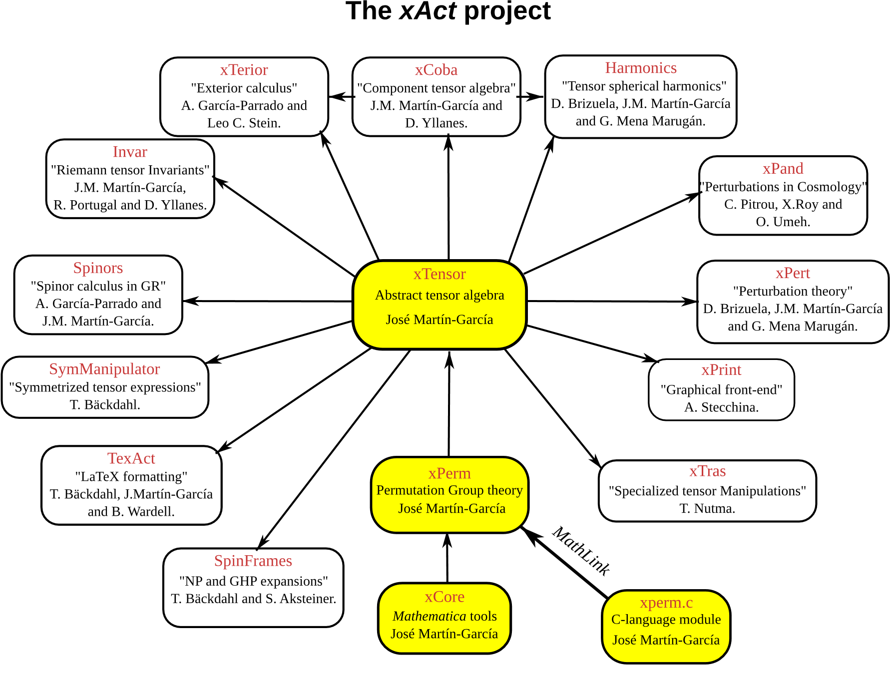

## 介绍

xAct 是一套用于 Wolfram 语言中的张量计算代数的免费软件包。xAct 实现了用于快速操作指标的最先进算法，并且以当前的广义相对论几何方法为基础进行建模。它具有高度的可编程性和可配置性。自 2004 年 3 月首次公开发布以来，xAct 已经过了大量的测试，并且成功解决了广义相对论中的一些难题。

xAct有四个主要的软件包：

- xCore：通用编程工具
- xPerm：大规模置换群的操作
- xTensor：抽象张量计算,用于处理张量与协变导数.
- xCoba：坐标系中的张量分析,用于张量分量的计算
  
## 安装
下面均以Windows为例,说明如何安装xAct包和Invar黎曼等式数据库(非必需).
### 安装xAct包

1. 进入xAct的[官网](https://xact.es),点击Download可以查看和下载安装包.
2. 打开Mathematica,新建一个`.nb`文件,然后输入以下代码查看包安装位置
```mathematica
$UserBaseDirectory <> "\\Applications"
```
按住`Shift`+`Enter`会返回如下结果

将解压后的xAct包放入该位置即可.要验证是否已经正确安装,只需要键入命令
```mathematica
<< xAct`xTensor`
```

如果出现如下的文字则说明xAct包安装成功.


### 安装Invar黎曼等式数据库(非必需)

Invar数据库内包含很多现成的黎曼张量相关的表达式，所以安装此数据库的好处之一是可以方便化简张量的抽象指标表达式。

1. 在xAct官网点击Packages,左下角找到Invar包,在Download and Installation一栏中下载`Riemann.tar.gz`和`Riemann expand4order12.tar.gz`文件并解压.
2. 将`Riemann`文件夹移动到xAct安装的位置`···/Applications/xAct/Invar`,并将解压后的`Riemann expand4order12.tar.gz`文件移入`Riemann`文件夹内


## 学习平台

### 通过Mathematica查找相应功能
如果想在Mathematica上查找`Metric`相关的函数,主要有以下三种方法:
- `?*Metric*`:给出所有包含`Metric`的内置函数;
- `?Metric*`:给出以`Metric`开头的内置函数;
- `?*Metric`:给出以`Metric`结尾的内置函数.

### 通过官方的文档和视频

[官方文档](https://josmar493.dreamhosters.com/documentation.html)上面有很多学习资料,现在归类如下:
- 关于作者的简单介绍 
  - Introductory talk (1 hour, pdf).
  - Basic concepts (2 hours, mathematica slide show).
  - Intermediate concepts (2 hours, mathematica slide show).
  - Advanced concepts (2 hours, mathematica slide show). 
  - xAct intro (Nov 23, 2022) in youtube, notebook of the talk
- 简单的入门教程
  - the introduction to xAct by Teake Nutma
  - the introductory tutorial by Jolyon Bloomfield. 
- 较为详细的教程 
  -  xAct Course held in Prague in 2018 by Alfonso García-Parrado
  -  full notebook of the talk
- 视频教程
  - xAct for the General Theory of Relativity
  - Tensor algebra made easy with Mathematica
- 他人分享的程序:[xAct example notebooks](https://josmar493.dreamhosters.com/documentation.html#:~:text=xAct%20example%20notebooks)

### 其他的网站
- [Mathematica & Wolfram Language](https://mathematica.stackexchange.com)

- [xAct-contrib github](https://github.com/xAct-contrib)

- [xAct Forum](https://groups.google.com/g/xact?pli=1)
